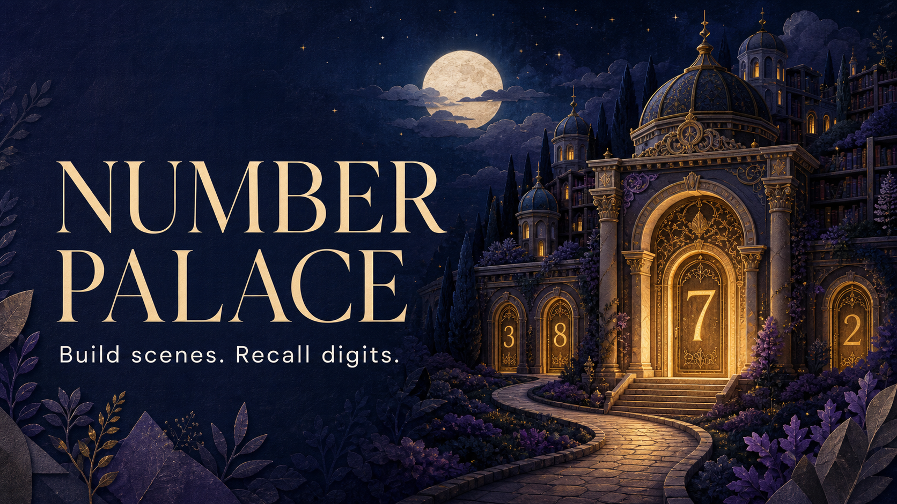

# Number Palace



Number Palace is an educational browser game that turns exact number sequences
into vivid mental scenes. Each player assigns a noun, adjective, and verb to
every digit from 0 through 9. The game then groups sequences into memorable
`noun -> adjective -> verb` scenes and helps the player practice recalling the
original digits.

**Contest track:** Education

**Live preview:** [number-palace-memory-game.benkouzel372105.chatgpt.site](https://number-palace-memory-game.benkouzel372105.chatgpt.site/)

## Why it exists

Long number sequences are abstract and easy to lose. A strange image such as
"Robin Hood, golden, praying" is much easier to picture. Number Palace gives
players a repeatable personal vocabulary for converting digits into those
images, then adds focused recall practice and progress tracking.

## Features

- Device-local player profiles with separate master word lists and progress
- Three selectable example codices for a quick start
- Fully editable custom noun, adjective, and verb mappings for digits 0-9
- Random number hashes from 3-36 digits
- A multiple-of-three recommendation for complete memory scenes
- Named custom sequences for repeatedly practicing important combinations
- Scene playback in a consistent noun, adjective, verb order
- Number-by-number recall with three progressive hint tiers
- Whole-sequence recall with answer reveal after three missed attempts
- Saved routes, practice statistics, responsive layouts, and keyboard-friendly
  forms

## How the memory system works

Every position repeats the same role pattern:

1. noun
2. adjective
3. verb

The included Mythic demo starts with this sample data:

| Digit | Noun | Adjective | Verb |
| --- | --- | --- | --- |
| 0 | Hercules | burning | lifting |
| 1 | Cthulhu | frozen | singing |
| 2 | Robin Hood | golden | praying |

For the sequence `201`, Number Palace plays:

> Robin Hood, burning, singing.

Those three scene elements still encode the exact digits `2`, `0`, and `1`
because each position has a known role. The stranger and more animated the
mental image, the easier it is to retrieve later.

## Quick start

Prerequisites:

- Node.js 22.13 or newer
- npm

```bash
git clone https://github.com/benkouzel-code/Number-palace.git
cd Number-palace
npm install
npm run dev
```

Open [http://localhost:3000](http://localhost:3000).

To try the project without creating a custom master list:

1. Select **Enter the quick demo** on the welcome screen.
2. Generate a 6-digit route or enter your own digits.
3. Read the generated rooms from left to right.
4. Choose **Number by number** or **Whole sequence**.

## Validation

```bash
npm run lint
npm test
```

`npm test` creates a production build and runs a rendered-HTML smoke test.

## Technology

- React 19 and TypeScript
- Next-compatible routing through Vinext
- Vite and Tailwind CSS 4
- Cloudflare Workers deployment through OpenAI Sites
- Browser `localStorage` for profiles and practice data
- Original environment art created with OpenAI image generation

## How Codex accelerated the build

Codex was the primary development workspace for Number Palace. It helped turn
the initial learning-game brief into a working product by:

- translating the mnemonic rules into typed game state and recall logic
- building the responsive interface and the two practice flows
- generating and integrating original visual assets
- catching inconsistencies in role order and making playback, configuration,
  and hints use the same noun-adjective-verb convention
- adding validation, tests, deployment configuration, and submission
  documentation

GPT-5.6 in Codex was used for the implementation and refinement workflow:
reasoning through the memory-model design, making cross-file changes, checking
the completed experience, and preparing it for judging. Important product
decisions remained explicit and human-directed: use a stable three-role order,
recommend sequence lengths divisible by three, reveal hints progressively, and
keep the first version private-by-default with device-local data.

## Architecture and data

The app is intentionally local-first. A `PlayerProfile` contains the player's
codex, named sequences, and practice statistics. The complete store is saved
under the browser key `number-palace-v1`.

Relevant files:

- `app/NumberPalaceGame.tsx` - game state, setup, sequence generation, practice,
  statistics, and local persistence
- `app/globals.css` - responsive visual system and interactions
- `app/page.tsx` - application entry point
- `public/number-palace-environment.png` - original generated environment art
- `tests/rendered-html.test.mjs` - production-render smoke test
- `.openai/hosting.json` - Sites deployment metadata

## Privacy and current limitations

- Profiles are lightweight local player profiles, not password-protected online
  accounts.
- Data stays in the current browser and device.
- Clearing site data removes local profiles and saved routes.
- Saved sequences should not be treated as securely stored secrets.
- There is no cloud sync or multiplayer mode in this version.

## Contest materials

Submission-ready copy, the recording outline, and the final release checklist
are in [`docs/`](docs/):

- [`devpost-submission.md`](docs/devpost-submission.md)
- [`demo-video-script.md`](docs/demo-video-script.md)
- [`submission-checklist.md`](docs/submission-checklist.md)

## License

Number Palace is available under the [MIT License](LICENSE).
